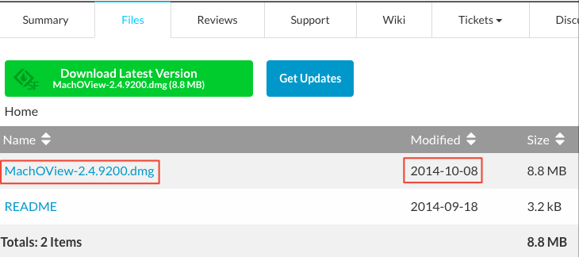

# NISCMachOView

## 下载App

地址: https://sourceforge.net/projects/machoview/

运行官网下载的最新App文件，当Open需要分析的二进制文件，这时App都会崩溃

能下载的版本:MachOView-2.4.9200.dmg

创建时间:2014年10月8日，比较老了，有问题也是正常的

## 下载源码

###1. gihub
地址:https://github.com/gdbinit/MachOView

下载下来的源码不兼容最新的Xcode版本，需要做一些修改

###2. sourceforge

地址:https://sourceforge.net/p/machoview/code/ci/master/tree/

这里的代码是最新的